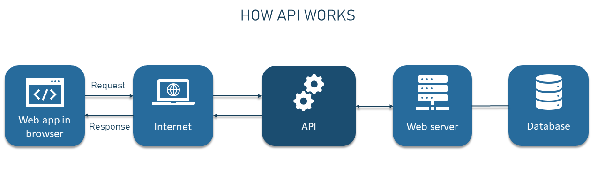
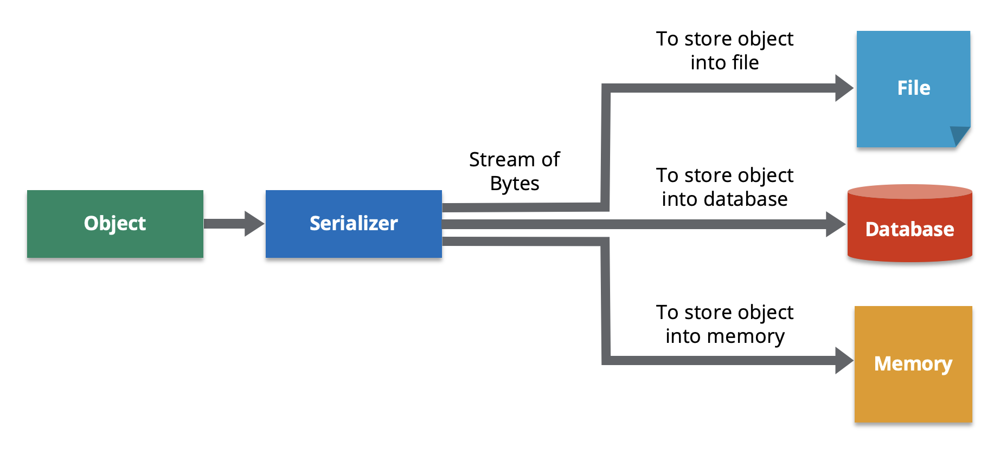
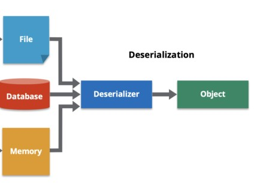
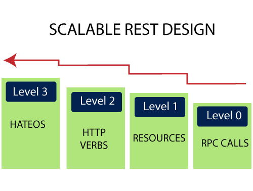
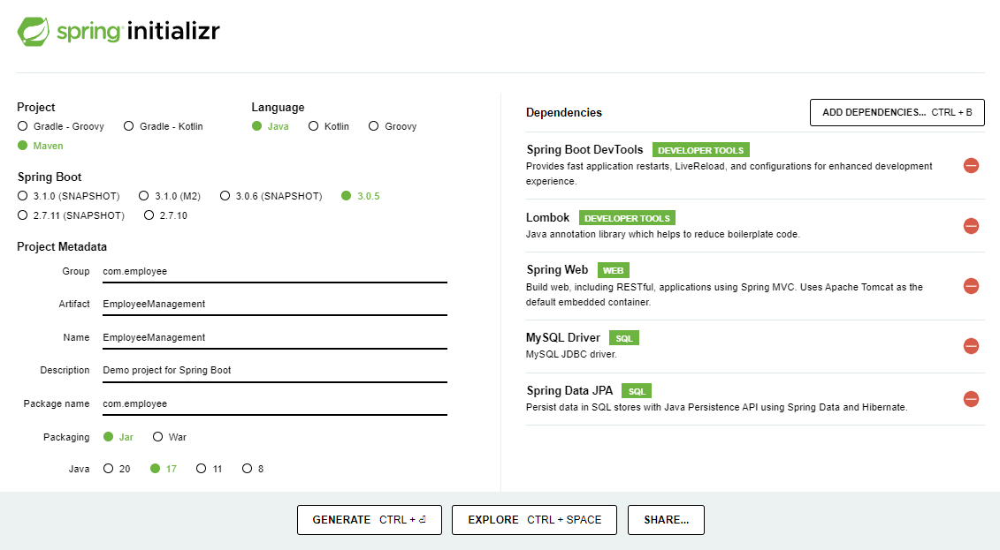
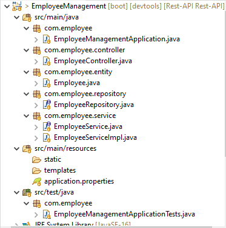
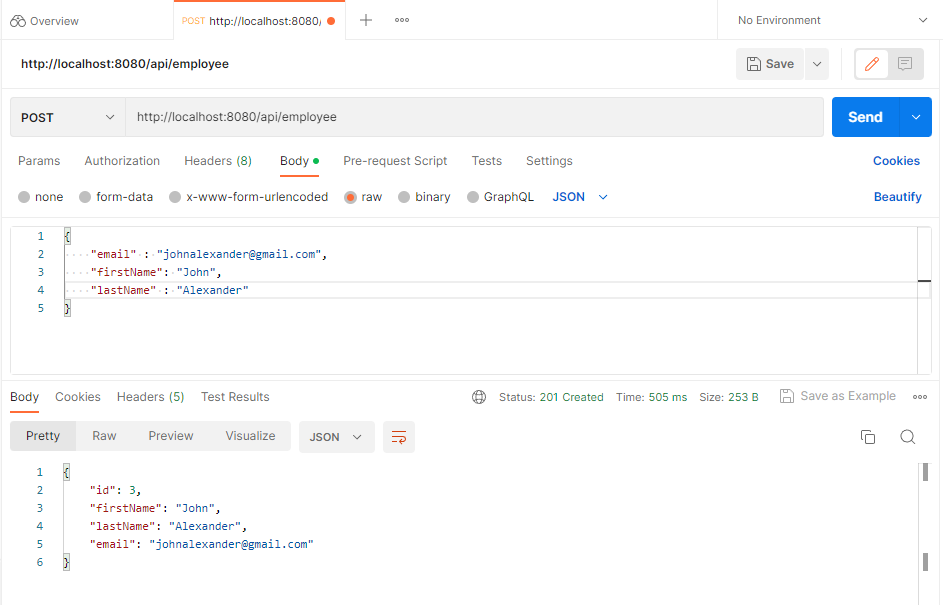
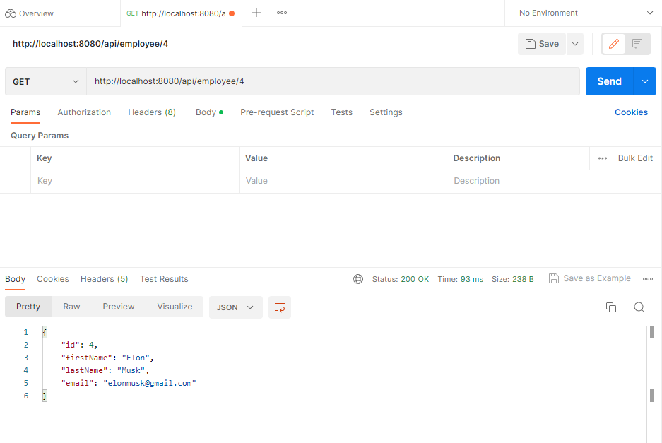
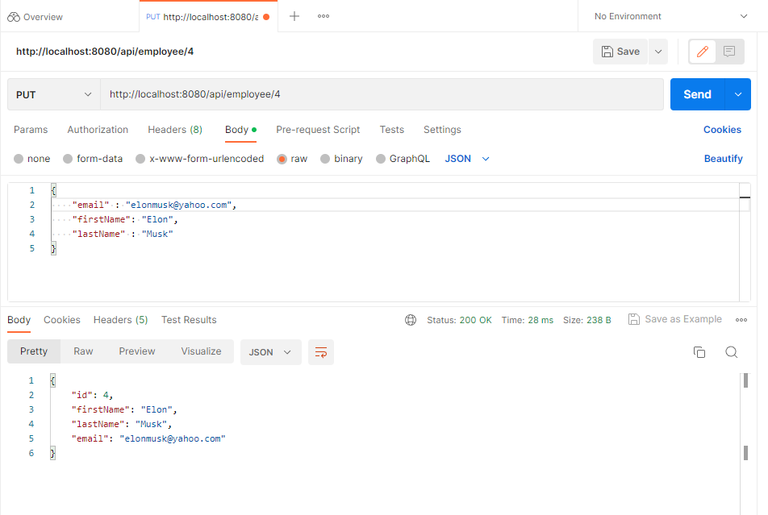
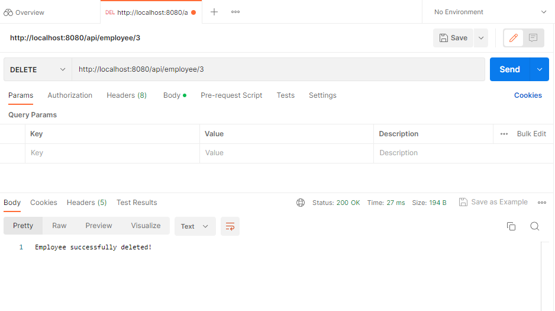

# Rest-API Tutorial


## TABLE OF CONTENT 

1. [**REST API**](#rest-api)<!-- style="font-size:20px" -->

2. [**Request & Response**](#request-and-response)<!-- style="font-size:20px" -->

3. [**Creating RestFul Services**](#creating-restful-services) <!-- style="font-size:20px" -->

4. [**Spring Boot CRUD REST API using MYSQL Database**](#spring-boot-crud-rest-api-using-mysql-database) <!-- style="font-size:20px" -->

5. **Caching**<!-- style="font-size:20px" -->

## **REST API**

* [**Introduction**](#introduction)<!-- style="font-size:18px" -->
* [**Need of Rest**](#need-of-rest)<!-- style="font-size:18px" -->
* [**RestFul Web API**](#restful-web-api)<!-- style="font-size:18px" -->
* [**An Intuitive understanding of REST**](#an-intuitive-understanding-of-rest) <!-- style="font-size:18px" -->
* [**REST Constraints or Principles**](#rest-constraints) <!-- style="font-size:18px" -->
* [**Serialization**](#serialization)<!-- style="font-size:18px" -->
* [**Deserialization**](#deserialization)<!-- style="font-size:18px" -->
* [**Richardson Maturity Model**](#richardson-maturity-model)<!-- style="font-size:18px" -->

### **INTRODUCTION**

* REST API, is a web service that follows the principles of Representational State Transfer (REST) architecture.
* REST is a set of architectural constraints that are applied to web services, which can be used to create highly scalable and flexible web services.


**What is API?**<!-- style="font-size:20px;font-family:Times New Roman;" -->

Application Programming Interface (API) is a software interface that allows two applications to interact with each other without any user intervention.



**What is REST?**<!-- style="font-size:20px;font-family:Times New Roman;" -->

Representational State Transfer(REST), is an architectural style for providing standards between computer systems on the web, making it easier for systems to communicate with each other. 

For example, when a developer calls Instagram API to fetch a specific user (the resource), the API will return the state of that user, including their name, the number of posts that user posted on Instagram so far, how many followers they have, and more.

The representation of the state can be in a JSON format, and probably for most APIs this is indeed the case. It can also be in XML or HTML format.

What the server does when you, the client, call one of its APIs depends on 2 things that you need to provide to the server:

* An identifier for the resource you are interested in. This is the URI for the resource, also known as the endpoint. In fact, URI stands for Uniform Resource Locator.
* The operation you want the server to perform on that resource, in the form of an HTTP method, or verb. The common HTTP methods are GET, POST, PUT, and DELETE.

### **Need of Rest**

* Seperate Client & Server
* REST is Independent of platform and language
* Flexibility & Scalability
* Not Constrained to one format can return (Xml,JSON etcc)
* Since built on top of HTTP, can take adavantage of HTTP cache
* Easy to use
* Discoverability

### **Rest Principle**

* **Uniform interface** : All API requests for the same resource should look the same, no matter where the request comes from. The REST API should ensure that the same piece of data, such as the name or email address of a user, belongs to only one uniform resource identifier (URI). Resources shouldn’t be too large but should contain every piece of information that the client might need.
* **Client-server decoupling** : In REST API design, client and server applications must be completely independent of each other. The only information the client application should know is the URI of the requested resource; it can't interact with the server application in any other ways. Similarly, a server application shouldn't modify the client application other than passing it to the requested data via HTTP.
* **Statelessness** : REST APIs are stateless, meaning that each request needs to include all the information necessary for processing it. In other words, REST APIs do not require any server-side sessions. Server applications aren’t allowed to store any data related to a client request.
* **Cacheability** : When possible, resources should be cacheable on the client or server side. Server responses also need to contain information about whether caching is allowed for the delivered resource. The goal is to improve performance on the client side, while increasing scalability on the server side.
* **Layered system architecture** In REST APIs, the calls and responses go through different layers. As a rule of thumb, don’t assume that the client and server applications connect directly to each other. There may be a number of different intermediaries in the communication loop. REST APIs need to be designed so that neither the client nor the server can tell whether it communicates with the end application or an intermediary.
* **Code on demand** : REST APIs usually send static resources, but in certain cases, responses can also contain executable code (such as Java applets). In these cases, the code should only run on-demand.

### **RestFul Web API**

Web API is an API as the name suggests, it can be accessed over the web using the HTTP protocol. It is a framework that helps you to create and develop HTTP based RESTFUL services. The web API can be developed by using different technologies such as java, ASP.NET, etc. 

**Need for Web API**<!-- style="font-size:20px;font-family:Times New Roman;" -->

* A Web API helps to access service data from different internet devices like browsers, mobile apps, and other devices.
* Helps to work on RESTful web services.
* Helps to develop light weighted and maintainable Web Services.
* Used to create both types of services RESTful and non-RESTful services.
* Also supports JSON, XML, and other data formats.
* Helps to develop services supporting all features of HTTP services such as like caching, request/response headers, versioning, etc.

### **An Intuitive understanding of REST**

* Rest is an architectural style
* Restful is referred to web services that implements REST
* It is simply a program that returns data from the database to the client in a format that it requests.
* It is based on HTTP, it reterives data through standard HTTP methods. GET,PUT,POST & DELETE.

### **REST Constraints or Principles** 

Architectural Constraints of RESTful API: There are six architectural constraints which makes any web service are listed below:

* [**Uniform Interface**](#uniform-interface)
* [**Stateless**](#stateless)
* [**Cacheable**](#cacheable)
* [**Client-Server**](#client-server)
* [**Layered System**](#layered-system)
* [**Code on Demand**](#code-on-demand)

#### **Uniform Interface**

It is a key constraint that differentiate between a REST API and Non-REST API. It suggests that there should be an uniform way of interacting with a given server irrespective of device or type of application (website, mobile app). 

There are four guidelines principle of Uniform Interface are:

* **Resource-Based** : Individual resources are identified in requests. For example: API/users.
* **Manipulation of Resources Through Representations** : Client has representation of resource and it contains enough information to modify or delete the resource on the server, provided it has permission to do so. Example: Usually user get a user id when user request for a list of users and then use that id to delete or modify that particular user.
* **Self-descriptive Messages** : Each message includes enough information to describe how to process the message so that server can easily analyses the request.
* **Hypermedia as the Engine of Application State (HATEOAS)** : It need to include links for each response so that client can discover other resources easily.

#### **Stateless**

It means that the necessary state to handle the request is contained within the request itself and server would not store anything related to the session. In REST, the client must include all information for the server to fulfill the request whether as a part of query params, headers or URI. Statelessness enables greater availability since the server does not have to maintain, update or communicate that session state. There is a drawback when the client need to send too much data to the server so it reduces the scope of network optimization and requires more bandwidth.

#### **Cacheable**

Every response should include whether the response is cacheable or not and for how much duration responses can be cached at the client side. Client will return the data from its cache for any subsequent request and there would be no need to send the request again to the server. A well-managed caching partially or completely eliminates some client–server interactions, further improving availability and performance. But sometime there are chances that user may receive stale data. 

#### **Client-Server**

REST application should have a client-server architecture. A Client is someone who is requesting resources and are not concerned with data storage, which remains internal to each server, and server is someone who holds the resources and are not concerned with the user interface or user state. They can evolve independently. Client doesn’t need to know anything about business logic and server doesn’t need to know anything about frontend UI. 

#### **Layered system**

An application architecture needs to be composed of multiple layers. Each layer doesn’t know any thing about any layer other than that of immediate layer and there can be lot of intermediate servers between client and the end server. Intermediary servers may improve system availability by enabling load-balancing and by providing shared caches. 

#### **Code on demand**

It is an optional feature. According to this, servers can also provide executable code to the client. The examples of code on demand may include the compiled components such as Java Servlets and Server-Side Scripts such as JavaScript. 

### **Serialization**

Serialization is a process of converting an object from its current state to a stream of bytes which can be written to a file or transported through a network or stored in a database.

Can serialize to any encoding format. Popular ones are Xml & JSON.



### **Deserialization**

Deserialization is the process of converting a stream of data into objects.The main purpose of serialization and deserialization is to persist the data and recreate whenever needed.

Can Deserialize from any encoding format. Popular ones are Xml & JSON.



### **Richardson Maturity Model**

* Richardson Maturity Model is a model developed by Lenoard Richardson.
* It grades APIs by their RestFul maturity.
* It breaks down the principal element of the REST approach into four levels (0 to 3).

There are four levels:

* [**Level 0: The Swamp of POX**](#level-0-the-swamp-of-pox)
* [**Level 1: Resources**](#level-1-resources)
* [**Level 2: HTTP Verbs**](#level-2-http-verbs)
* [**Level 3: Hypermedia Control**](#level-3-hypermedia-control)



#### **Level 0 The Swamp of POX**

Level 0 is also often referred to as POX (Plain Old XML). At level 0, HTTP is used only as a transport protocol. For zero maturity level services, we use a single URI and a single HTTP method. We send a request to the same URI for obtaining and posting the data. Only the POST method can be used. for example, A particular company can have a lot of customers or users. We have only one endpoint for all the customers. All operations are performed via the POST method.  

```markdown
To get the data: POST http://localhost:8080/users
To post the data: POST http://localhost:8080/users
```

#### **Level 1 Resources**

In level 1 , each resource is mapped to a specific URI. However, only one HTTP method (POST) is used for retrieving and creating data. for example, we need to access the employees working in a company.

```markdown
To add an employee to a particular department:
POST/department/<department-id>/employee
To access a specific employee :
POST/department/<department-id>/employee/<employee-id>
```

#### **Level 2 HTTP Verbs**

At Level 2 requests are sent with the correct HTTP verb. A correct HTTP response code is returned for each request.

For example: To get the users of the company, we send a request with the URI

```markdown
http://localhost:8080/users and the server sends proper response 200 OK.
```

#### **Level 3 Hypermedia Control**

Level 3 is the highest level. It is the combination of level 2 and HATEOAS. It also provides support for HATEOAS. It is helpful in self-documentation.

For example, if we send a GET request for users, we will get a response for users in JSON format with self-documenting Hypermedia.

## **Request and Response**

* [**HTTP Request**](#understanding-http-request) <!-- style="font-size:18px" -->
* [**HTTP Response**](#http-responses) <!-- style="font-size:18px" -->
* [**HTTP Methods**](#http-methods) <!-- style="font-size:18px" -->
* [**Designing Rest URIs**](#designing-rest-URIs) <!-- style="font-size:18px" -->

### **HTTP Request**

* HTTP Request is a message from client to server
* If user clicks on the below hyperlink

```markdown
href = "http://localhost:8081/categories/02/books"

Show all the books in the 2nd Categories
```

* The HTTP Message request will be sent a

```markdown
GET: /categories/02/books HTTP/1.1
HOST:localhost:8081
User-Agent:Mozilla/4.0 (Compatible; Windows NT)
```

* URI - /categories/02/books
* Request Method - GET 
* HTTP Specification - 1.1
* Domain: localhost,Port:8081

### **HTTP Responses**

* HTTP Response is a message from server to client.
* For every request, there will be response
* An Typical HTTP Response

```markdown
HTTP/1.1 200 OK
DATE: Wed,19 Apr 2023 02:12:55 GMT
Content-Type: application/json; charset=utf-16
Content-Length:31

{
    "id":1,
    "name":"John"
}
```
* 200 OK is the HTTP Status code.
* Content Type indicates the type of the content within the message body.
* Content Length indicates the total no of characters in the message body.
* We can see the request & response in developers tools in your browser.

### **HTTP Methods**

For HTTP/1.1, the set of common methods are defined below. This set can be expanded based on the requirements. The name of these methods is case sensitive, and they must be used in uppercase.

| **_Method_**                     | **_Description_**                                                                                                                                                                 |
|----------------------------------|-----------------------------------------------------------------------------------------------------------------------------------------------------------------------------------|
| **GET**                          | The GET method is used to retrieve information from the given server using a given URI. Requests using GET should only retrieve data and should have no other effect on the data. |
| **HEAD**                         | Same as GET, but it transfers the status line and the header section only.                                                                                                        |
| **POST**                         | A POST request is used to send data to the server, for example, customer information, file upload, etc. using HTML forms.                                                         |
| **PUT**                          | Replaces all the current representations of the target resource with the uploaded content.                                                                                        |
| **DELETE**                       | Removes all the current representations of the target resource given by URI.                                                                                                      |
| **CONNECT**                      | Establishes a tunnel to the server identified by a given URI.                                                                                                                     |
| **OPTIONS**                      | Describe the communication options for the target resource.                                                                                                                       |
| **TRACE**                        | Performs a message loop back test along with the path to the target resource.                                                                                                     |

### **Designing Rest URIs**

* Represent Hierarchial relationships by '/'

> Example: `http://localhost:8081/ProductCategory/SubCategory/Products`
> <br>
> within product category,there are many sub categories,and with subcategories there are many products

*  Use plural nouns when required 

> Example: `http://localhost:8081/Organization/Departments/1`
> <br>
> To indicate that there are many departments within an organization

* Design to improve redability 

> Example: **USE** `http://localhost:8081/Products/user-ratings`
> <br>
> **rather than** `http://localhost:8081/Products/userRatings`

* Do not use file extensions like .html,.asp etc..,

## **Creating RestFul Services**

* [**Controllers and Actions**](#controllers-and-actions) <!-- style="font-size:18px" -->
* [**Creating Routing Templates**](#creating-routing-templates) <!-- style="font-size:18px" -->
* [**Understanding Routing Attributes**](#understanding-routing-attributes) <!-- style="font-size:18px" -->
* [**Using Parameters in Request**](#using-parameters-in-request) <!-- style="font-size:18px" -->
* [**Model Validation**](#model-validation) <!-- style="font-size:18px" -->

### **Controllers and Actions**

* Controllers are nothing but classes that inherit from APIController class
* When a user hits an URL, the URL will be mapped to the appropriate Controller according to the routing defined.
* Controllers have Methods called Actions
* So every request to a URL will invoke the method in the appropriate Controller. The method will get executed and return a HTTP Response.

### **Creating Routing Templates**

* A Route template looks similar to URI with placeholders
* When a route template is created, you can specify defaults
> **Example:**
><br>
>`api/{controller}/{ProductCategory}/{id}`
><br>
>defaults: new {ProductCategory = "Books"}
><br>
>For this template, an URI like `api/Products/2` will always fetch data from Books category 
* A route template can also provide constraints
> new `{id : int}`
> <br>
> For the above example, the request wil be routed only if the id is of type integer.

### **Understanding Routing Attributes**

* By default, a GET request on a URL, Web API will route the request to a method name that is 'GET' or starts with 'Get..'

* **Example:** A Get request on a URI can invoke any of the action methods

    1. GET()
    2. GetCustomers()

* Or,alternatively, you can decorate the Action method with any of the attributes

    1. HttpGet
    2. HttpPut
    3. HttpPost
    4. HttpDelete

* You can also use [Accept Verbs] attribute to allow only certain requests to a method

* To prevent a method from getting invoked, you can use the [NonAction] attribute

### **Using Parameters in Request**

* Parameter binding is passing parameters from URI/requests to the Action methods.
* If the parameter is a simple type, Web API tries to read the parameter from the URI.
* If the parameter is a complex type, Web API tries to read the parameter from the Request Body using mediatype formatter.
* **Example:** 
> MethodName(int price,Product p)
> <br>
> For this Method, since price is a simple type, it tries to read the value from the URL
> <br>
> Since product is a complex type, it tries to read the value from the Request Body.

### **Model Validation**

* Sometimes, we need to validate the data before doing any processing. This is called Model Validation.
* We case use Data Annotation to perform model validation.
* Some of the commonly used Annotations are:

    1. [Required] - to indicate that a field is required
    2. [Range(0,10)] - to specify that the input values in this range.
* You can use ModelState .isValid to check the data against the validation attributes.
* Under-Posting - if all the values of a class are not specified.
* Over-Posting - if additional values of class are specified.

## **Spring Boot CRUD REST API using MySQL Database**

* [**Initializing Spring Project**](#initializing-spring-project) <!-- style="font-size:18px" -->
* [**Project Structure**](#project-structure) <!-- style="font-size:18px" -->
* [**Configuring MySQL Database**](#configuring-mysql-database) <!-- style="font-size:18px" -->
* [**Create JPA Entity**](#create-jpa-entity) <!-- style="font-size:18px" -->
* [**Create Spring Data JPA Repository**](#create-spring-data-jpa-repository) <!-- style="font-size:18px" -->
* [**Service Layer Implementation**](#service-layer-implementation) <!-- style="font-size:18px" -->
* [**Building CRUD Rest APIs**](#building-crud-rest-apis) <!-- style="font-size:18px" -->
* [**Test CRUD REST APIs using Postman**](#test-crud-rest-apis-using-postman) <!-- style="font-size:18px" -->

### **Initializing Spring Project**

You can use the Spring Initializer website (start.spring.io) to generate a new Spring Boot project with the necessary dependencies.

Refer to the below screenshot to enter details while creating the spring boot application using the [spring initializr](https://start.spring.io/):



Click on Generate button to download the Spring boot project as a zip file. Unzip the zip file and import the Spring boot project in Spring Tool Suite.

Here is the pom.xml file for your reference:

```htm
<?xml version="1.0" encoding="UTF-8"?>
<project xmlns="http://maven.apache.org/POM/4.0.0" xmlns:xsi="http://www.w3.org/2001/XMLSchema-instance"
	xsi:schemaLocation="http://maven.apache.org/POM/4.0.0 https://maven.apache.org/xsd/maven-4.0.0.xsd">
	<modelVersion>4.0.0</modelVersion>
	<parent>
		<groupId>org.springframework.boot</groupId>
		<artifactId>spring-boot-starter-parent</artifactId>
		<version>3.0.5</version>
		<relativePath/> <!-- lookup parent from repository -->
	</parent>
	<groupId>com.employee</groupId>
	<artifactId>EmployeeManagement</artifactId>
	<version>0.0.1-SNAPSHOT</version>
	<name>EmployeeManagement</name>
	<description>Demo project for Spring Boot</description>
	<properties>
		<java.version>17</java.version>
	</properties>
	<dependencies>
		<dependency>
			<groupId>org.springframework.boot</groupId>
			<artifactId>spring-boot-starter-data-jpa</artifactId>
		</dependency>
		<dependency>
			<groupId>org.springframework.boot</groupId>
			<artifactId>spring-boot-starter-web</artifactId>
		</dependency>

		<dependency>
			<groupId>org.springframework.boot</groupId>
			<artifactId>spring-boot-devtools</artifactId>
			<scope>runtime</scope>
			<optional>true</optional>
		</dependency>
		<dependency>
			<groupId>com.mysql</groupId>
			<artifactId>mysql-connector-j</artifactId>
			<scope>runtime</scope>
		</dependency>
		<dependency>
			<groupId>org.springframework.boot</groupId>
			<artifactId>spring-boot-starter-test</artifactId>
			<scope>test</scope>
		</dependency>
		<dependency>
			<groupId>org.projectlombok</groupId>
			<artifactId>lombok</artifactId>
			<optional>true</optional>
		</dependency>  
	</dependencies>

	<build>
		<plugins>
			<plugin>
				<groupId>org.springframework.boot</groupId>
				<artifactId>spring-boot-maven-plugin</artifactId>
			</plugin>
		</plugins>
	</build>

</project>

```

### **Project Structure**

Refer to the below screenshot to create a project structure or a packing structure for our Spring boot application:



### **Configuring MySQL Database**

Since we’re using MySQL as our database, we need to configure the URL, username, and password so that our Spring boot can establish a connection with the database on startup. Open the `src/main/resources/application.properties` file and add the following properties to it:

```markdown
## MYSQL Configuration
spring.datasource.url=jdbc:mysql://localhost:3306/db_restapi?createDatabaseIfNotExist=true&autoReconnect=true&useSSL=false
spring.datasource.username=root
spring.datasource.password=password

## JPA PROPERTIES
spring.jpa.properties.hibernate.dialect=org.hibernate.dialect.MySQL8Dialect
spring.jpa.hibernate.ddl-auto=update
```

Don’t forget to change the spring.datasource.username and spring.datasource.password as per your MySQL installation.

### **Create JPA Entity**

An Entity is a plain old Java object (POJO) that represents the data you want to store. You will need to annotate the class with @Entity and define the fields of the class along with the getters and setters for each field.

Let's create a Employee JPA entity class with the following fields: 
id - primary key
firstName - employee first name
lastName - employee last name
email - employee email ID

```java
package com.employee.entity;

import jakarta.persistence.Column;
import jakarta.persistence.Entity;
import jakarta.persistence.GeneratedValue;
import jakarta.persistence.GenerationType;
import jakarta.persistence.Id;
import jakarta.persistence.Table;
import lombok.AllArgsConstructor;
import lombok.Getter;
import lombok.NoArgsConstructor;
import lombok.Setter;

@Getter
@Setter
@NoArgsConstructor
@AllArgsConstructor
@Entity
@Table(name="employee")
public class Employee {
	
	@Id
	@GeneratedValue(strategy = GenerationType.IDENTITY)
	private long id;
	
	@Column(name = "first_name", nullable = false)
	private String firstName;
	
	@Column(name = "last_name")
	private String lastName;
	
	@Column(name = "email")
	private String email;

}
```

Note that we are using Lombok annotations to reduce the boilerplate code such as getter/setter methods, and constructors.

We are using below JPA annotations to map an Entity with a database table:

* @Entity annotation is used to mark the class as a persistent Java class.
* @Table annotation is used to provide the details of the table that this entity will be mapped to.
* @Id annotation is used to define the primary key.
* @GeneratedValue annotation is used to define the primary key generation strategy. In the above case, we have declared the primary key to be an Auto Increment field.
* @Column annotation is used to define the properties of the column that will be mapped to the annotated field. You can define several properties like name, length, nullable, updateable, etc.

### **Create Spring Data JPA Repository**

Let's create a EmployeeRepository to access the Employee's data from the database.

Well, Spring Data JPA comes with a JpaRepository interface that defines methods for all the CRUD operations on the entity, and a default implementation of JpaRepository called SimpleJpaRepository.

```java
package com.employee.repository;

import org.springframework.data.jpa.repository.JpaRepository;
import org.springframework.stereotype.Repository;

import com.employee.entity.Employee;

@Repository
public interface EmployeeRepository extends JpaRepository<Employee, Long> {

}
```

### **Service Layer Implementation**

This layer will contain the business logic for the API and will be used to perform CRUD operations using the Repository.

**EmployeeService Interface**

```java
package com.employee.service;

import java.util.List;

import com.employee.entity.Employee;

public interface EmployeeService {
	
	    Employee createEmployee(Employee employee);

	    Employee getEmployeeById(Long employeeId);

	    List<Employee> getAllEmployee();

	    Employee updateEmployee(Employee employee);

	    void deleteEmployee(Long employeeId);
	
}
```

**EmployeeServiceImpl Class**

```java
package com.employee.service;

import java.util.List;
import java.util.Optional;

import org.springframework.stereotype.Service;

import com.employee.entity.Employee;
import com.employee.repository.EmployeeRepository;

import lombok.AllArgsConstructor;

@Service
@AllArgsConstructor
public class EmployeeServiceImpl implements EmployeeService {

	private EmployeeRepository employeeRepository;

	@Override
	public Employee createEmployee(Employee employee) {
		return employeeRepository.save(employee);
	}

	@Override
	public Employee getEmployeeById(Long employeeId) {
		Optional<Employee> optionalUser = employeeRepository.findById(employeeId);
		return optionalUser.get();
	}

	@Override
	public List<Employee> getAllEmployee() {
		return employeeRepository.findAll();
	}

	@Override
	public Employee updateEmployee(Employee employee) {
		Employee existingEmployee = employeeRepository.findById(employee.getId()).get();
		existingEmployee.setFirstName(employee.getFirstName());
		existingEmployee.setLastName(employee.getLastName());
		existingEmployee.setEmail(employee.getEmail());
		Employee updatedEmployee = employeeRepository.save(existingEmployee);
		return updatedEmployee;
	}

	@Override
	public void deleteEmployee(Long employeeId) {
		employeeRepository.deleteById(employeeId);
	}
}
```

### **Building CRUD Rest APIs**

The controller is responsible for handling incoming HTTP requests and returning the appropriate response. You will need to define the endpoints of the API and map them to the appropriate methods in the Service layer.

Let's create the REST APIs for creating, retrieving, updating, and deleting a Employee:

```java
package com.employee.controller;

import java.util.List;

import org.springframework.beans.factory.annotation.Autowired;
import org.springframework.http.HttpStatus;
import org.springframework.http.ResponseEntity;
import org.springframework.web.bind.annotation.DeleteMapping;
import org.springframework.web.bind.annotation.GetMapping;
import org.springframework.web.bind.annotation.PathVariable;
import org.springframework.web.bind.annotation.PostMapping;
import org.springframework.web.bind.annotation.PutMapping;
import org.springframework.web.bind.annotation.RequestBody;
import org.springframework.web.bind.annotation.RequestMapping;
import org.springframework.web.bind.annotation.RestController;

import com.employee.entity.Employee;
import com.employee.service.EmployeeService;

import lombok.AllArgsConstructor;

@RestController
@AllArgsConstructor
@RequestMapping("/api/employee")
public class EmployeeController {
	
	@Autowired
	private EmployeeService employeeService;
	
	// build create employee REST API
	@PostMapping
    public ResponseEntity<Employee> createEmployee(@RequestBody Employee employee){
        Employee savedEmployee = employeeService.createEmployee(employee);
        return new ResponseEntity<>(savedEmployee, HttpStatus.CREATED);
    }
	
	// build get employee by id REST API
    // http://localhost:8080/api/employee/1
	@GetMapping("{id}")
    public ResponseEntity<Employee> getEmployeeById(@PathVariable("id") Long userId){
		Employee employee = employeeService.getEmployeeById(userId);
        return new ResponseEntity<>(employee, HttpStatus.OK);
    }
	
	// Build Get All Employees REST API
    // http://localhost:8080/api/employee
	@GetMapping
    public ResponseEntity<List<Employee>> getAllEmployee(){
        List<Employee> employee = employeeService.getAllEmployee();
        return new ResponseEntity<>(employee, HttpStatus.OK);
    }
	
	// Build Update Employee REST API
	// http://localhost:8080/api/employee/1
	@PutMapping("{id}")
    public ResponseEntity<Employee> updateEmployee(@PathVariable("id") Long employeeId,
                                           @RequestBody Employee employee){
		employee.setId(employeeId);
        Employee updatedEmployee = employeeService.updateEmployee(employee);
        return new ResponseEntity<>(updatedEmployee, HttpStatus.OK);
    }
	
	// Build Delete Employee REST API
    @DeleteMapping("{id}")
    public ResponseEntity<String> deleteUser(@PathVariable("id") Long employeeId){
        employeeService.deleteEmployee(employeeId);
        return new ResponseEntity<>("Employee successfully deleted!", HttpStatus.OK);
    }

}
```

### **Test CRUD REST APIs using Postman**

* [**Create User REST API**](#create-user-rest-api) <!-- style="font-size:18px" -->
* [**Get Single User REST API**](#get-single-user-rest-api) <!-- style="font-size:18px" -->
* [**Update User REST API**](#update-user-rest-api) <!-- style="font-size:18px" -->
* [**Get All Users REST API**](#get-all-users-rest-api) <!-- style="font-size:18px" -->
* [**Delete User REST API**](#delete-user-rest-api) <!-- style="font-size:18px" -->

#### **Create User REST API**

<br>



#### **Get Single User REST API**

<br>



#### **Update User REST API**

<br>



#### **Get All Users REST API**

<br>


#### **Delete User REST API**

<br>

