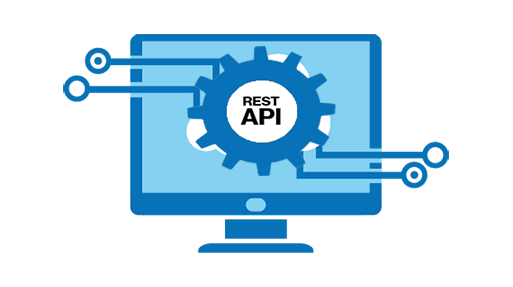

# Rest-API

## TABLE OF CONTENT 

1. **REST API**<!-- style="font-size:20px" -->

    * **Introduction**<!-- style="font-size:18px" -->
    * **Need of Rest**<!-- style="font-size:18px" -->
    * **RestFul Web API**<!-- style="font-size:18px" -->
    * **Comparison of APIs**<!-- style="font-size:18px" -->
    * **An Intuitive understanding of REST**<!-- style="font-size:18px" -->
    * **REST Constraints**<!-- style="font-size:18px" -->
    * **Concept of Serialization**<!-- style="font-size:18px" -->
    * **Concept of Deserialization**<!-- style="font-size:18px" -->
    * **Richardson Maturity Model**<!-- style="font-size:18px" -->

2. **Request & Response**<!-- style="font-size:20px" -->

    * **Understanding HTTP Request**<!-- style="font-size:18px" -->
    * **HTTP Request Methods**<!-- style="font-size:18px" -->
    * **Analyze HTTP Response**<!-- style="font-size:18px" -->
    * **Designing Rest URLs**<!-- style="font-size:18px" -->

3. **Creating RestFul Services**<!-- style="font-size:20px" -->

    * **Controllers and Actions**<!-- style="font-size:18px" -->
    * **Creating Routing Templates**<!-- style="font-size:18px" -->
    * **Understanding Routing Attributes**<!-- style="font-size:18px" -->
    * **Using Parameters in Request**<!-- style="font-size:18px" -->
    * **Model Validation**<!-- style="font-size:18px" -->

4. **Working with Database**<!-- style="font-size:20px" -->

    * **Creating Domain Models**<!-- style="font-size:18px" -->
    * **Scaffolding Controllers**<!-- style="font-size:18px" -->
    * **Database Seeding**<!-- style="font-size:18px" -->
    * **Migrations**<!-- style="font-size:18px" -->
    * **Using DTOs**<!-- style="font-size:18px" -->
    * **Implementing Paging**<!-- style="font-size:18px" -->
    * **CORS and Enabling CORS**<!-- style="font-size:18px" -->
    * **Deferred Execution**<!-- style="font-size:18px" -->

5. **Caching**<!-- style="font-size:20px" -->

    * **Introduction to Caching**<!-- style="font-size:18px" -->
    * **Expiration Model**<!-- style="font-size:18px" -->
    * **Validation Model**<!-- style="font-size:18px" -->
    * **Cache-Control Directives**<!-- style="font-size:18px" -->
    * **Concurrency in Rest**<!-- style="font-size:18px" -->
    * **JSON Serialization**<!-- style="font-size:18px" -->
    * **Cache Model Validation**<!-- style="font-size:18px" -->